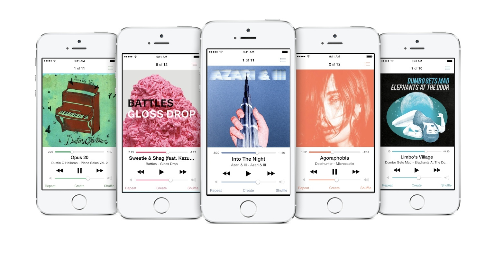
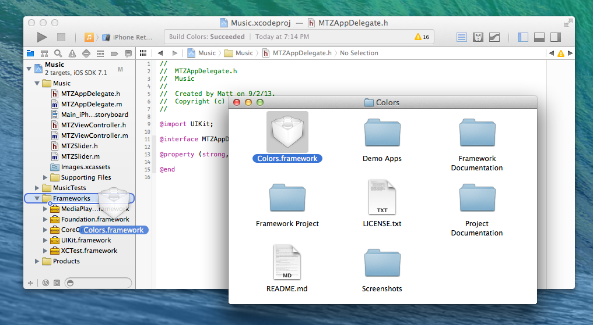

#Colors
===

**Important**: This is preliminary documentation for an API and technology in development. This information is subject to change. This document may be updated with future developments of the API and technology.

Contents:

* Introduction
* Demo
* Contributing
* Documentation
* Adding the Colors framework to your project
* Using the Colors Framework in your project

###Introduction
===

Colors is a collection of UIColor categories and helper APIs for picking colors and generating color schemes. Bring life and beauty into your iOS application through dynamic user interfaces.

If you're using this in your project, I'd love to hear about it! [Email me](mailto:matt@mdznr.com?subject=Using%20Colors%20Project%20in...) and tell me how you're using it.

###Demo
===

Included in the repo are demo applications (located in "Demo Apps" folder in the repo's root directory) showing off what this framework can do for your application. **Note**: All apps are not fully functional and are for demonstration purposes only.

In this demo music application, key colors are grabbed from the album artwork and displayed across the rest of the UI on the currently presented view controller.

The code necessary for the color part of application shown above is simple. When the song changes, it calls `refreshColors:` on the now playing view controller (`_iv` is the `UIImageView` containing the album art).

	- (void)refreshColors
	{
		UIColor *keyColor = [_iv.image keyColorToContrastAgainstColors:@[[UIColor whiteColor]]
		                                           withMinimumContrast:UIColorContrastLevelLow];
		if ( keyColor ) {
			[[UIApplication sharedApplication] keyWindow].tintColor = keyColor;
		} else {
			UIColor *bg = [_iv.image backgroundColorToContrastAgainstColors:@[[UIColor whiteColor],
			                                                                  [UIColor lightGrayColor]]
			                                            withMinimumContrast:UIColorContrastLevelLow];
			if ( !bg ) bg = [UIColor blackColor];
			[[UIApplication sharedApplication] keyWindow].tintColor = [UIColor neueBlue];
			_trackSlider.tintColor = bg;
			_volumeSlider.tintColor = bg;
		}
	}

This method will search the image for a key-color appropriate color for use on a white background. If a sufficient color is not found, it returns nil. The case where the return value is `nil` is handled by doing a search for a general background-color to contrast against the white background and be different than the light gray color of the maximum slider component (right-side of sliders). The background defaults to black in the rare case no color data is found from image. The background color can be applied to the sliders because there are no key-color requirements. The buttons must have a key color appropriate tint color, so a default blue is used in that situation.

###Contributing
===

There are, of course, tons of changes, improvements, and simplifications I've been thinking about and may integrate in the future. I'm only one person, so any contributions are much appreciated.

To report any bugs not mentioned in the Notes and Known Issues section, use the Github Issue Tracker on the repo's Github page ([https://github.com/mdznr/Colors/issues](https://github.com/mdznr/Colors/issues "Bug Reporter")).

Feel free to go through the issue tracker to find and fix issues and enhancements to the project. [Email me](mailto:matt@mdznr.com?subject=Contributing%20to%20Colors%20Project&body=Hello,%20I'd%20like%20to%20help%20with%20the%20Colors%20Project.%20How%20can%20I%20help?) with any questions you may have. Then, submit a pull request. Thank you for helping out!

###Documentation
===

Documentation coming soon (once issue with [appledoc](https://github.com/tomaz/appledoc) is resolved).

<!--
#*****WARNING: Get online documentation url*****

Read the [Colors Documentation](http://www.github.com/mdznr/Colors "Colors Documentation") online.

Install the documentation into Xcode with the following steps:

1. Open Xcode Preferences
2. Choose Downloads
3. Choose the Documentation tab
4. #*****WARNING: This doesn't work?*****
4. Click the plus button in the bottom right and enter the following URL:

#*****WARNING: Generate atom*****

		http://github.com/mdznr/Colors/Documentation/com.mattzanchelli.colors.atom
	
5. Click Install next the new row reading "Colors Documentation". (If you don't see it and didn't get an error, try restarting Xcode.)

Be sure you have the docset selected in the organizer to see results for Colors.
-->

###Adding the Colors framework to your project
===

#####Option 1 (Use framework as-is):
If you just wish to add the framework at it's current state to your project, simply drag and drop Colors.framework (located in the repo's root directory) to the Project Navigator in Xcode.

Then, just add `-ObjC` and `-all_load` to Other Linker Flags in your Xcode Project. (This makes sure that the categories in the framework attach to the classes in other frameworks

Any future updates to the framework require the framework file to be manually replaced.

If you are still having issues, try looking one of the including demo apps (In the "Demo Apps" folder in the repo's root directory)

#####Option 2 (Modify framework and use):
If you wish to modify the framework, or are doing development on the framework itself, and want to use it in an application, you must build the Framework Project (Framework Project/Colors.xcodeproj) yourself.

1. After building the project, right-click on libColors.a under Products in the Project Navigator in Xcode.

2. In that same directory, there should be a file named Colors.framework.

3. Move and replace Colors.framework to the root of the Colors repo. Use this framework in your app. **Note:** At this point in time, this must be done manually after each change.

###Using the Colors Framework in your project
===

To use the Colors framework, simply add the following line to your source file:

		<!-- Objective-C -->
		#import <Colors/Colors.h>

You can also import individual files instead of the whole framework (for faster compile times) by doing something like:

		<!-- Objective-C -->
		#import <Colors/UIColor+NeueColors.h>

